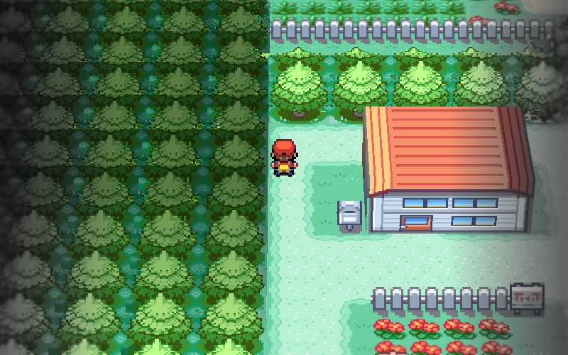
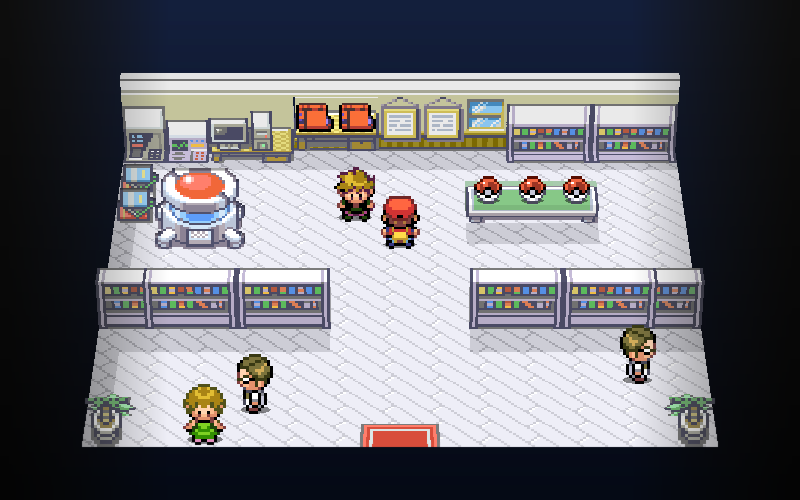

# gba

[](https://github.com/x0cero/gba/actions/workflows/ci.yml)

Game Boy Advance emulator written from scratch in Rust, with an experimental 3D view for Pokémon FireRed. The original 2D renderer matched mGBA in a 9,000-frame scripted comparison.

**[Download v1.2.0](https://github.com/x0cero/gba/releases/tag/v1.2.0)** for macOS, Windows, or Linux. This release improves 3D characters, interiors and hidden-player markers. See the [changelog](CHANGELOG.md).

**[Play it in your browser](https://x0cero.github.io/gba/)**: the same Rust core compiled to WebAssembly. Drop in your own `.gba` file, or click "Run CPU test suite" to see the emulator work without one.

The browser version uses the original 2D display. The 3D view requires the desktop download.

No emulation libraries and no ported reference code: the ARM7TDMI core, the PPU, the DMA controller, the timers, the save hardware and the audio path were each built against the hardware documentation and test ROMs, one failing case at a time. No BIOS image is required; the BIOS calls games actually make are implemented in high-level Rust.


  

Screenshots are framebuffer dumps from this emulator (Pokémon FireRed is © Game Freak and Nintendo, Kirby: Nightmare in Dream Land is © HAL Laboratory and Nintendo; no ROMs are included or distributed).

## Accuracy

The standout claim is not "it boots" but "it matches". Pokémon FireRed was run for 9,000 frames (about two and a half minutes of gameplay) under a scripted input sequence, and every frame was compared against mGBA running the identical script. The output was pixel-for-pixel identical the whole way through.

The methodology is reproducible from this repo. `tools/refprobe.c` links against libmgba (installed via `brew install mgba`) and drives mGBA with the same scripted input this emulator accepts through `GBA_INPUT`. Both sides dump their framebuffer, palette RAM, OAM and VRAM at the same frame numbers, and the dumps are diffed. When they diverge, the first differing frame plus the register-level dumps point at the exact hardware behavior that is wrong. Most of the harder bugs in this project (the DMA address latching, the affine sprite transform, the IntrWait flag semantics) were found this way rather than by staring at code.

On the standard suites, the CPU core passes the jsmolka `arm`, `thumb` and `memory` tests in full.

[docs/differential-testing.md](docs/differential-testing.md) is a full writeup of the harness, the bisect method, the bugs it caught, and what differential testing cannot catch.

## Features

- **ARM7TDMI CPU**: the complete ARM and Thumb instruction sets, mode banking, the SPSR/CPSR machinery, and interrupt dispatch.
- **PPU**: modes 0 through 5, text and affine backgrounds, regular and affine sprites, the two windows plus the object window, alpha blending and brightness effects, and scanline-accurate timing.
- **BIOS high-level emulation**: `CpuSet`/`CpuFastSet`, `Div`/`Sqrt`/`ArcTan2`, LZ77, RLE, Huffman and BitUnPack decompression, `ObjAffineSet`/`BgAffineSet`, and `IntrWait`/`VBlankIntrWait` with the real flag semantics. You do not need to supply a BIOS dump.
- **DMA** in all four channels covering immediate, vblank, hblank and sound-FIFO timing, with hardware-correct address latching (the registers are write-only and the internal pointers advance independently).
- **Timers** with cascade, and the keypad including its interrupt.
- **Audio**: both DirectSound FIFO channels plus all four PSG channels, mixed with output headroom and a low-pass filter, paced off the audio clock so the picture does not drift against the sound.
- **Every common save medium, auto-detected**: 32 KB SRAM, 64 KB flash (Panasonic), 128 KB two-bank flash (Sanyo), and bit-serial EEPROM over DMA3 in both the 512 byte and 8 KB variants. The medium is inferred from the SDK marker string left in the ROM, and the emulator prints which one it chose at startup.
- **Quality of life**: save states, pause, and hold-to-fast-forward.
- **3D diorama mode** (`--3d`): renders the overworld of Pokémon FireRed as a tilted miniature built from the game's live map data, reusing its original artwork on map-based geometry. See below.
- **iOS frontend**: a SwiftUI app in `ios/` that drives the same Rust core through a C FFI layer, with touch controls, a game library, and MFi controller support.

## Building and running

```sh
cargo build --release
./target/release/gba path/to/rom.gba
```

No ROMs are included in this repository, and none ever will be. The test ROMs used during development are [jsmolka/gba-tests](https://github.com/jsmolka/gba-tests), which CI clones on every run.

### Download

Prebuilt binaries for macOS (Apple Silicon), Linux (x86_64), and Windows (x86_64) are attached to each tagged release on the [releases page](https://github.com/x0cero/gba/releases). Download the archive for your platform, unpack it, and run the binary with a ROM path.

Battery saves are written to `<rom>.gba.sav` next to the ROM, sized to whatever save chip the cartridge actually declares. Save states go to `<rom>.gba.state`.

## Controls

| GBA | Keyboard |
|-----|----------|
| A / B | Z / X |
| Start / Select | Enter / Right Shift |
| D-pad | Arrow keys |
| L / R | Q / W |
| Save state / load state | F5 / F7 |
| Pause | P |
| Fast-forward (hold) | Tab |
| Quit | Esc |

## 3D diorama mode

```sh
./target/release/gba path/to/firered.gba --3d
```





The original game still runs in the emulator; `--3d` changes how the scene is drawn. The default view keeps FireRed's original tree artwork and building textures. Trees stand as whole artwork units, buildings are extruded from the live map, and characters remain sprites. Active overworld characters use complete sprite tiles, including those outside the original 240×160 screen. Windows and doors stay on building fronts, and a tinted marker shows the player behind scenery. Indoor bookcases combine their cap, shelves and base into solid cabinets; supported back walls stand upright. Oak’s lab has verified profiles for its table, round machine and book stands. Table items use the surface height; equipment keeps its complete original outline instead of being extruded tile by tile. Other furniture still uses the general tile classifier. Map borders use the dimensions stored in the ROM. Battles and full-screen menus fall back to 2D; dialogue is overlaid on the scene.

The experimental polygon-tree and pitched-roof version is opt-in only:

```sh
GBA_3D_STYLE=modeled ./target/release/gba path/to/firered.gba --3d
```

`tools/regress3d.py` checks camera motion, figure placement, warps, post-processing and determinism. It also checks model stability when run with `GBA_3D_STYLE=modeled`. `cargo test` covers save hardware, border decoding, renderer history, mesh geometry and perspective texture interpolation. The main tuning variables are `GBA_3D_PERSP` (lens, default 3), `GBA_TILT` (blur, 0 to 3, default 2 for the original style), `GBA_MARGIN` (edge fading), `GBA_TREE_TALL`, `GBA_WOOD`, and `GBA_3D_WALL`. The 3D renderer is native desktop only.

The silhouette uses scenery depth captured before any character is drawn, shared by all maps. Run the optional ROM layout audit with:

```sh
GBA_AUDIT_ROM=/path/to/firered.gba cargo test --release --bin gba all_rom_layouts -- --ignored --nocapture
```

This reads a local US FireRed ROM without opening or writing saves. It discovers layout records, loads their tile graphics and palettes, and checks silhouette masking at the center and four corners under both indoor and outdoor boundary rules. It includes unused layouts. The audit uses a synthetic character mask and reconstructed map grids, so it tests scenery depth and masking, not live NPC behavior, connected-map transitions, animated tiles, or whether each furniture shape is visually correct. Normal unit tests also cover partial scenery coverage, transparent sprite pixels, screen clipping and foreground characters.

## Architecture

- `src/cpu.rs`: the ARM7TDMI core. Fetch, decode, execute, the pipeline, mode switching, and interrupt entry.
- `src/bus.rs`: the memory map and everything hanging off it. DMA, timers, the interrupt controller, the keypad, save-chip emulation, the BIOS high-level calls, and the DirectSound mixer.
- `src/ppu.rs`: the scanline renderer and the LCD state machine.
- `src/psg.rs`: the four legacy Game Boy sound channels.
- `src/voxel.rs`: map decoding, camera tracking and rasterization for `--3d`.
- `src/voxel/actors.rs`: full overworld sprites and positions from FireRed’s live object events. Distant actors that the game has completely unloaded remain outside this path.
- `src/voxel/interiors.rs`: indoor cabinet units, back walls and the lab table profile.
- `src/voxel/models.rs`: procedural tree meshes and outdoor building geometry. Per-frame layer capture lives in `src/ppu.rs`.
- `src/lib.rs`: the C FFI surface that the iOS app links against.
- `src/wasm.rs`: the wasm-bindgen surface behind the browser demo, built by `scripts/build-wasm.sh` into `web/pkg/`.
- `web/`: the browser frontend (canvas, keyboard, Web Audio worklet), published to GitHub Pages.
- `ios/`: the SwiftUI frontend over that FFI.

## Verification and debugging tools

Everything below is driven by environment variables, so a failing case can be reproduced headlessly and diffed.

- `GBA_FRAMES=N ./target/release/gba rom.gba --headless` renders N frames and writes `frame.ppm`.
- `GBA_INPUT="100-110:a,200-260:up"` scripts button presses by frame range, which is what makes deterministic playthroughs and mGBA comparisons possible.
- `GBA_DUMP_EVERY=K` with `GBA_DUMP_DIR` writes a filmstrip of frames so you can find the exact frame where a picture goes wrong.
- `GBA_WAV=1` captures the last ten seconds of audio to `samples.raw` as 32-bit float stereo.
- Targeted trace hooks: `GBA_SWILOG`, `GBA_IOLOG`, `GBA_MODELOG`, `GBA_BOOTTRACE`, `GBA_PALTRACE`, `GBA_BADPTR`, `GBA_OBJDEBUG`, `GBA_BREAK`, `GBA_SAVELOG`.

## Status and known gaps

These are honest trade-offs, documented rather than hidden.

- **Timing is region-aware, not cycle-accurate.** Instructions are costed by which memory region the program counter is in (1 cycle in IWRAM, 3 in EWRAM, 4 in ROM). There is no prefetch buffer and no sub-instruction memory timing. Games that lean on exact cycle counts rather than the standard interrupts will misbehave.
- **No serial or link cable, and no real-time clock.** FireRed needs neither, but games that do (the Ruby/Sapphire berry clock, any link trading) will not work.
- **Some SWI calls are unimplemented.** The set games actually reach is covered; the rest fall through rather than being emulated.
- **Modes 1 and 2 affine backgrounds are lightly exercised**, since the games tested here do not use them heavily.
- **A ROM with no save marker at all falls back to 128 KB flash**, which is a guess rather than a detection.
- **3D geometry remains experimental.** Some furniture and unusual buildings still use heuristic shapes. Active characters outside the original viewport are rendered, but characters completely unloaded by the game can still pop in.
- **Coverage has limits.** Unit tests cover save hardware and renderer behavior; gameplay regressions exercise selected routes and interiors. The ROM layout audit checks silhouette masking, not every visual detail or scripted event. The 2D accuracy claim rests on the documented test ROM suites and mGBA comparison.

## License

MIT. See [LICENSE](LICENSE).
