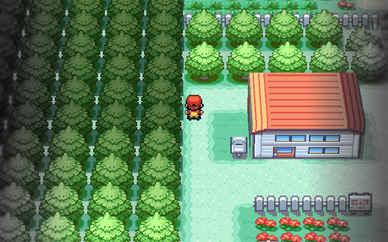

# gba

[](https://github.com/x0cero/gba/actions/workflows/ci.yml)
[](https://discord.gg/KMWnFJ5tre)

A Game Boy Advance emulator written from scratch in Rust, with an alpha 3D mode that draws Pokémon FireRed as a tilted miniature built from the game's own map data.

- **[Download v1.2.1](https://github.com/x0cero/gba/releases/latest)** for macOS, Windows or Linux
- **[Play in the browser](https://x0cero.github.io/gba/)** (2D only, drop in your own `.gba`)
- [Changelog](CHANGELOG.md)
- [Discord](https://discord.gg/KMWnFJ5tre) for bugs, saves and questions

No ROMs are included and none ever will be. Bring your own.



## 3D mode (alpha)

```sh
./gba path/to/firered.gba --3d
```


The game runs normally. `--3d` only changes how each frame is drawn: the renderer reads the map out of the game's memory while it runs and stands the buildings, trees and furniture up from that, using the original artwork. Nothing is modelled by hand, so it works on any save. Characters stay sprites. Battles and menus drop back to 2D.

**This is an alpha.** Pallet Town, Oak's lab, Viridian City and Route 1 have been checked. Everything past that has only been run through an automated audit, not played, so expect wrong shapes in later towns, caves and odd buildings. If a place renders wrong, [open an issue](https://github.com/x0cero/gba/issues/new?template=3d-rendering-bug.md) with the town name and a screenshot.

The 3D renderer is desktop only. FireRed is the only game it understands. Details, tuning variables, the regression suite and the audit are in [docs/3d-mode.md](docs/3d-mode.md).

## The emulator


The 2D emulator underneath is the real thing, not a wrapper. The ARM7TDMI core, the PPU, DMA, timers, save hardware and audio were each built against the hardware documentation and test ROMs, with no emulation libraries and no ported reference code. No BIOS image is needed; the BIOS calls games actually make are implemented in Rust.

**Accuracy.** FireRed was run for 9,000 frames under a scripted input sequence and compared frame by frame against mGBA running the identical script. The output was pixel-for-pixel identical the whole way. The CPU core passes the jsmolka `arm`, `thumb` and `memory` suites in full. [docs/differential-testing.md](docs/differential-testing.md) explains the harness and what it found.

**What is in it**

- ARM7TDMI: the complete ARM and Thumb sets, mode banking, interrupts
- PPU: modes 0 to 5, text and affine backgrounds, regular and affine sprites, windows, blending, scanline-accurate timing
- BIOS high-level emulation: `CpuSet`, `Div`, `Sqrt`, LZ77, RLE, Huffman, `ObjAffineSet`, `IntrWait` with the real flag semantics, and the rest games actually call
- DMA on all four channels with hardware-correct address latching; timers with cascade; keypad interrupt
- Audio: both DirectSound FIFOs and all four PSG channels, paced off the audio clock
- Saves auto-detected from the ROM's SDK marker: SRAM, 64 KB and 128 KB flash, 512 B and 8 KB EEPROM
- Save states, pause, hold-to-fast-forward
- A browser build (WebAssembly, touch controls, installable) and an iOS frontend in `ios/`

  

Screenshots are framebuffer dumps from this emulator. Pokémon FireRed is © Game Freak and Nintendo, Kirby: Nightmare in Dream Land is © HAL Laboratory and Nintendo.

## Running

Download the archive for your platform from the [releases page](https://github.com/x0cero/gba/releases), unpack it, and run it with a ROM path:

```sh
./gba-macos-arm64 path/to/rom.gba        # 2D
./gba-macos-arm64 path/to/firered.gba --3d
```

Or build it yourself with `cargo build --release`.

Battery saves are written to `<rom>.gba.sav` next to the ROM. Save states go to `<rom>.gba.state`.

| GBA | Keyboard |
|-----|----------|
| A / B | Z / X |
| Start / Select | Enter / Right Shift |
| D-pad | Arrow keys |
| L / R | Q / W |
| Save state / load state | F5 / F7 |
| Pause | P |
| Fast-forward (hold) | Tab |
| Quit | Esc |

## Known gaps

- Timing is region-aware, not cycle-accurate. Games that depend on exact cycle counts will misbehave.
- No link cable and no real-time clock.
- Some SWI calls are unimplemented (the ones games do not reach).
- Affine background modes 1 and 2 are lightly exercised.
- A ROM with no save marker falls back to 128 KB flash, which is a guess.
- 3D mode: see the alpha note above and [docs/3d-mode.md](docs/3d-mode.md).

## Development

Build commands, the source layout, headless runs, trace hooks and the release process are in [docs/development.md](docs/development.md).

## License

MIT. See [LICENSE](LICENSE).
